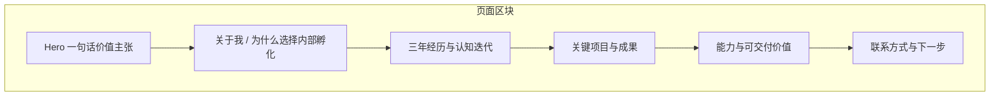

# 个人展示网站方案（面向猎头与知名企业）

## 一、目标与受众

- **受众**：猎头、大厂/知名企业 HR、内部孵化/创新业务负责人  
- **目的**：快速建立「有创业实战、又能在大平台内独立做项目」的印象，争取面试与内部孵化机会  
- **叙事主线**：三年创业 → 认知与能力迭代 → 希望借助平台资源继续做从 0 到 1，同时保留独立运作空间

---

## 二、网站信息架构

建议采用「一屏一个主题、自上而下讲故事」的单页结构，便于猎头 30 秒扫完、HR 2 分钟细看。




| 区块        | 内容要点                                             | 面向企业的价值                      |
| --------- | ------------------------------------------------ | ---------------------------- |
| **Hero**  | 姓名 + 一句定位（如「三年创业，专注 X 领域从 0 到 1；寻求平台资源下的内部孵化机会」） | 3 秒内传达「你是谁、你要什么」             |
| **关于我**   | 简短背景 + **为什么从创业转向内部孵化**（平台资源、独立做项目两不误）           | 化解「会不会不稳定」的顾虑，体现成熟选择         |
| **经历与迭代** | 三年时间线：关键节点、失败/转折、认知升级（可配合 1–2 句金句）               | 展示学习能力、抗压与迭代，贴合内部孵化「允许试错」的语境 |
| **关键项目**  | 2–4 个代表性项目：背景、你的角色、结果/数据、学到什么                    | 用事实证明「能独立带项目、有业务结果」          |
| **能力与价值** | 可结构化为：业务洞察、0–1 搭建、团队/协作、行业理解等；避免空泛形容词，用「能交付什么」表述 | 方便猎头/HR 做岗位匹配                |
| **联系方式**  | 手机/邮箱/微信（可选）、LinkedIn（若有）、「欢迎进一步沟通」CTA           | 降低联系门槛                       |


---

## 三、内容策略（如何符合「他们的要求」）

- **突出「内部孵化」相关特质**  
  - 从 0 到 1 的经验（项目从立项到上线/迭代）  
  - 在资源有限下的决策与结果  
  - 失败或转折后的复盘与调整（可引用「钉钉/语雀」类案例说明大厂也看重试错与学习）
- **弱化「纯创业者」风险顾虑**  
  - 在「关于我」或首屏明确写：寻求的是「平台 + 独立做项目」的结合，而非单纯打工或单纯创业  
  - 用时间线或项目经历体现：有目标感、能落地、能协作
- **便于筛选与匹配**  
  - 能力区块使用关键词（如行业、职能、项目类型），便于猎头搜索和 HR 对标 JD  
  - 项目尽量带结果（数据、用户量、合作方等），哪怕是指数量级
- **专业但不花哨**  
  - 排版清晰、层次分明；避免动效过多或信息过载  
  - 建议：深色或浅色单一主色 + 大量留白 + 一种主字体 + 一种强调色（如链接/按钮）

---

## 四、技术方案（Next.js）

- **框架**：Next.js 14+（App Router），便于 SEO、部署与后续加页（如「详细案例」「文章」）。  
- **样式**：Tailwind CSS，快速实现响应式与统一设计语言。  
- **结构建议**：  
  - 单页为主：各区块为同一页面的 `<section>`，通过导航锚点跳转。  
  - 若项目较多，可保留「项目详情」为独立路由（如 `/projects/[slug]`），首屏只展示精选 2–4 个。
- **部署**：Vercel 一键部署，绑定自定义域名（如 `yourname.com`），提升专业度与可信度。  
- **性能与 SEO**：  
  - 首屏关键信息放在首屏 HTML，便于爬虫与预览。  
  - 适当使用 `metadata`、`description`，方便在微信/钉钉/邮件中展示摘要。

---

## 五、设计方向（符合猎头与企业的审美）

- **风格**：简洁、专业、可读优先；避免游戏化、二次元或过于「创客」的视觉。  
- **排版**：  
  - 标题层级清晰（H1 仅一个，用于 Hero 或姓名）。  
  - 正文行宽控制（约 45–75 字/行），行高舒适。
- **色彩**：  
  - 主色 1 个（如深蓝/深灰代表稳重），强调色 1 个（链接、按钮、关键数字）。  
  - 背景与文字对比度符合可访问性要求。
- **响应式**：移动端优先（很多猎头用手机刷），导航可收束为汉堡菜单，锚点仍可用。

不采用复杂动效、不自动播放大声量视频，避免在办公室打开时的尴尬。

---

## 六、推荐项目文件结构

```
Personal_introduction/
├── app/
│   ├── layout.tsx          # 全局布局、字体、metadata
│   ├── page.tsx             # 单页：各 Section 组合
│   ├── globals.css
│   └── projects/
│       └── [slug]/page.tsx  # 可选：项目详情页
├── components/
│   ├── Hero.tsx
│   ├── About.tsx
│   ├── Timeline.tsx
│   ├── Projects.tsx
│   ├── Skills.tsx
│   ├── Contact.tsx
│   └── layout/
│       ├── Header.tsx       # 锚点导航
│       └── Footer.tsx
├── content/                 # 可选：项目/经历 Markdown 或 JSON
├── public/
└── package.json
```

内容可先写在组件内或 `content/` 中，后续再迁到 CMS（若需要你自行更新）。

---

## 七、实施顺序建议

1. **初始化项目**：`create-next-app`，接入 Tailwind，配置中文与基础 metadata。
2. **布局与导航**：Header（锚点）+ Footer，保证移动端可用。
3. **按区块开发**：Hero → About → Timeline → Projects → Skills → Contact，每块用占位文案先上线。
4. **内容填充**：用你的真实经历、项目与认知迭代替换占位符，重点打磨「关于我」和「关键项目」。
5. **视觉统一**：定主色/强调色/字体，做一轮响应式与可访问性检查。
6. **部署与域名**：Vercel 部署，绑定自定义域名，在简历与 LinkedIn 中写上网站链接。

---

## 八、后续可扩展

- 增加「文章/思考」页：展示认知深度，利于长期 SEO 与复访。  
- 增加简单联系表单（如 Formspree）或「预约沟通」链接（Calendly 等）。  
- 若投外企或国际化团队，再增加英文版或 `/en` 路由。